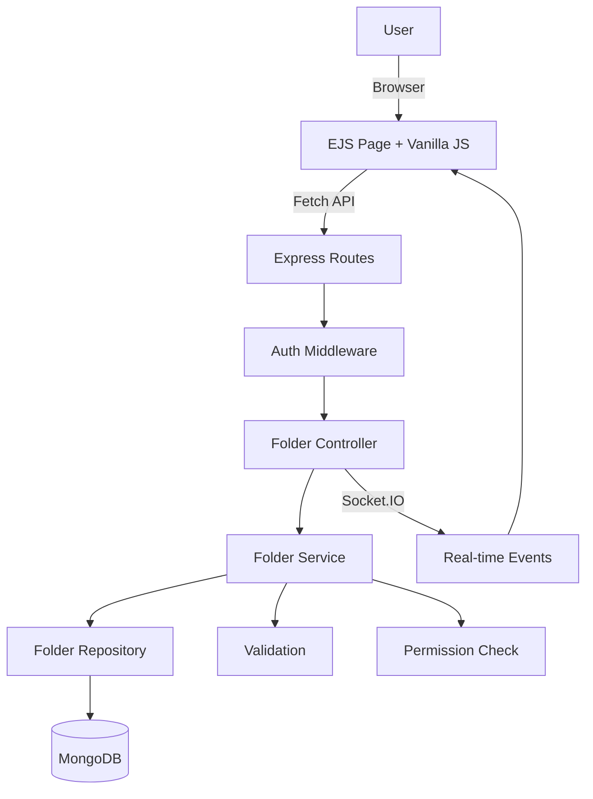
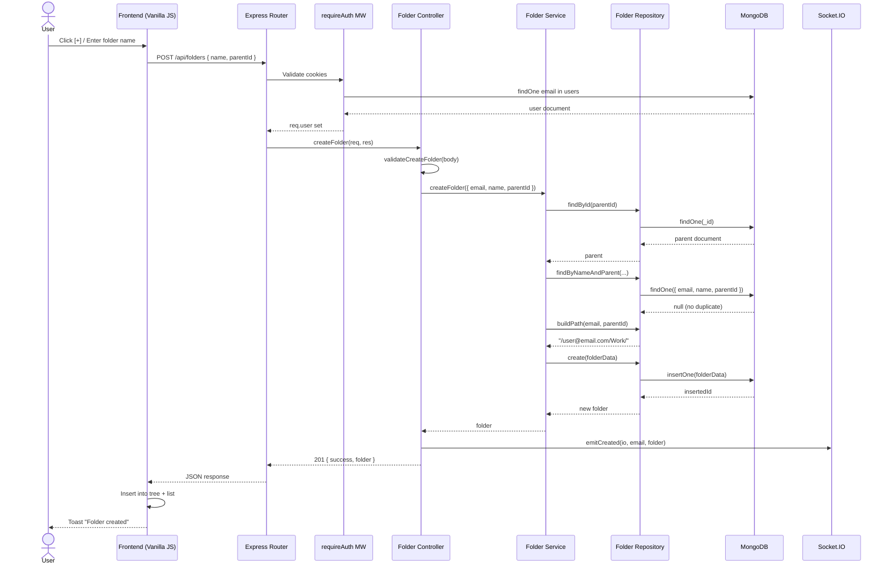
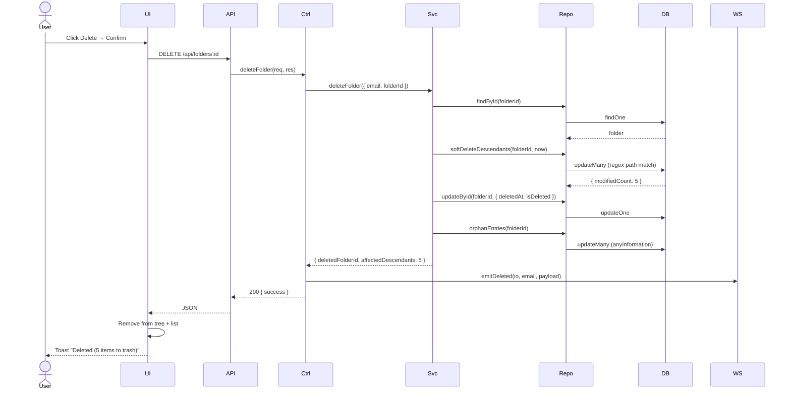
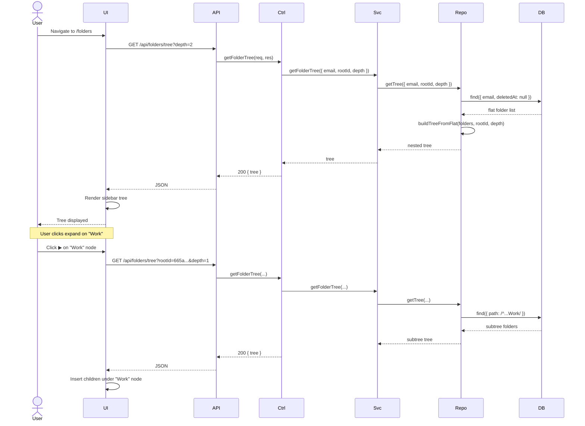
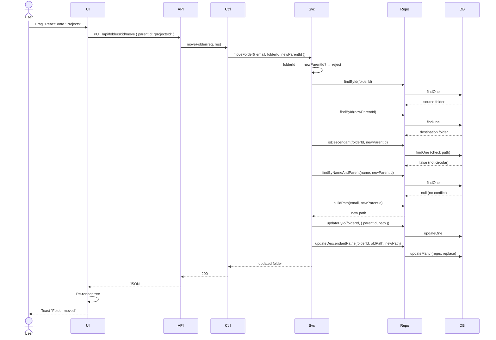

# Folder Feature — Complete Architecture & Implementation Plan

> **Project:** SHARE_INFO  
> **Stack:** Express 5.2.1 · MongoDB (native driver) · EJS SSR · Vanilla JS · Cookie Auth  
> **Date:** 2026-07-25  
> **Goal:** Production-ready nested folder system scalable to millions of folders with RBAC, soft-delete, and future extensibility (file uploads, sharing, favorites, trash, activity logs).

---

## Table of Contents

1. [High-Level Architecture](#1-high-level-architecture)
2. [Frontend (UI)](#2-frontend-ui)
3. [Backend Architecture](#3-backend-architecture)
4. [Database Design](#4-database-design)
5. [API Design](#5-api-design)
6. [Feature Workflow](#6-feature-workflow)
7. [Folder Tree Handling](#7-folder-tree-handling)
8. [Permissions](#8-permissions)
9. [Edge Cases](#9-edge-cases)
10. [Performance](#10-performance)
11. [Testing](#11-testing)
12. [Best Practices](#12-best-practices)
13. [Sequence Diagrams](#13-sequence-diagrams)
14. [Deliverables](#14-deliverables)

---

## 1. High-Level Architecture

### 1.1 System Architecture

```
┌─────────────────────────────────────────────────────────────────┐
│                        CLIENT (Browser)                         │
│  ┌──────────┐  ┌──────────┐  ┌──────────┐  ┌───────────────┐  │
│  │ EJS Pages │  │ Vanilla  │  │ Socket.IO│  │  Fetch API    │  │
│  │  (SSR)    │  │ JS UI    │  │ Client   │  │  (REST calls) │  │
│  └─────┬────┘  └────┬─────┘  └────┬─────┘  └───────┬───────┘  │
│        └─────────────┴─────────────┴────────────────┘           │
└─────────────────────────────┬───────────────────────────────────┘
                              │ HTTP / WebSocket
┌─────────────────────────────┴───────────────────────────────────┐
│                     EXPRESS SERVER (server.js)                   │
│  ┌──────────┐  ┌──────────┐  ┌──────────┐  ┌───────────────┐  │
│  │  Routes   │→│Controller│→│ Service  │→│  Repository    │  │
│  │ authRoutes│  │ Handlers │  │  Layer   │  │ (DB queries)  │  │
│  │ folderRts │  │          │  │          │  │               │  │
│  └──────────┘  └──────────┘  └──────────┘  └───────┬───────┘  │
│                                                      │          │
│  ┌──────────┐  ┌──────────┐  ┌──────────────────────┴───────┐  │
│  │Middleware │  │ Socket.IO│  │  config/mongodb.js           │  │
│  │ auth/err  │  │ events   │  │  getCollection("folders")    │  │
│  └──────────┘  └──────────┘  └──────────────┬───────────────┘  │
└──────────────────────────────────────────────┼──────────────────┘
                                               │
┌──────────────────────────────────────────────┴──────────────────┐
│                     MONGODB ATLAS                               │
│  ┌──────────┐  ┌──────────┐  ┌──────────┐  ┌───────────────┐  │
│  │  folders  │  │ anyInfo  │  │  users   │  │ activityLogs  │  │
│  │ collection│  │(entries) │  │          │  │ (future)      │  │
│  └──────────┘  └──────────┘  └──────────┘  └───────────────┘  │
└─────────────────────────────────────────────────────────────────┘
```

### 1.2 Folder Feature Responsibilities

| Responsibility | Description |
|---|---|
| **Hierarchy Management** | Create, rename, move, delete nested folders up to infinite depth |
| **Ownership** | Every folder belongs to one user; shared folders via future permission system |
| **Workspace Scoping** | Folders are scoped per-user (email), with admin/master cross-user access |
| **Soft Delete** | Deleted folders go to trash; recoverable within configurable window |
| **Tree Operations** | Build and serve full tree or lazy-loaded subtrees |
| **Search** | Fuzzy name search across user's folder hierarchy |
| **Audit Trail** | Track who created, modified, moved, or deleted folders (future: activity logs) |
| **Entry Association** | Entries (`anyInformation`) gain an optional `folderId` field to belong to a folder |

### 1.3 Component Interaction Diagram



### 1.4 Request/Response Flow

```
UI Action (click/type)
  → Vanilla JS event handler
    → fetch("/api/folders", { method, body })
      → Express Router matches route
        → requireAuth middleware (cookie validation)
          → Folder Controller handler
            → Input validation (DTO)
              → Folder Service (business logic)
                → Permission check (isOwner/isAdmin)
                  → Folder Repository (MongoDB queries)
                    → Database response
                  ← Repository returns result
                ← Service enriches/transforms
              ← Controller sends JSON response
            ← HTTP response to browser
          ← UI updates DOM
```

### 1.5 Folder Lifecycle

```
                    ┌─────────────┐
                    │   Created   │
                    └──────┬──────┘
                           │
                    ┌──────▼──────┐
              ┌─────│   Active    │─────┐
              │     └──────┬──────┘     │
              │            │            │
        ┌─────▼────┐ ┌────▼─────┐ ┌───▼──────┐
        │ Renamed  │ │  Moved   │ │ Contents │
        └──────────┘ └──────────┘ │ Modified │
                                  └──────────┘
                           │
                    ┌──────▼──────┐
                    │  Soft Delete │  (moved to trash)
                    └──────┬──────┘
                           │
                ┌──────────┼──────────┐
                │                     │
         ┌──────▼──────┐      ┌──────▼──────┐
         │  Restored   │      │  Permanent  │
         │ (back to    │      │   Delete    │
         │  Active)    │      │ (after 30d) │
         └─────────────┘      └─────────────┘
```

---

## 2. Frontend (UI)

### 2.1 Directory Structure

```
views/
  folders.ejs                    # Main folder page (SSR shell)
  partials/
    folderTree.ejs               # Server-rendered initial tree HTML
    folderBreadcrumb.ejs         # Breadcrumb navigation partial

public/
  js/
    folders.js                   # Folder page main logic
    folderTree.js                # Tree rendering & interaction
    folderBreadcrumb.js          # Breadcrumb navigation
    folderModal.js               # Create/Rename/Move modals
    folderSearch.js              # Search within folders
    folderDragDrop.js            # Drag-and-drop move (future)
  css/
    folders.css                  # Folder-specific styles
    folder-tree.css              # Tree hierarchy styles
    folder-modal.css             # Modal styles
```

> **Note:** This project uses EJS + Vanilla JS (no React/Vue). The "components" are JavaScript modules that manipulate the DOM directly.

### 2.2 Folder List Page

The main page at `/folders` renders a split layout: tree sidebar on the left, content area on the right showing the selected folder's contents (subfolders + entries).

```
┌─────────────────────────────────────────────────────────────┐
│  [≡] Folders                              [🔍 Search] [+]  │
├──────────────────┬──────────────────────────────────────────┤
│                  │  📂 My Folder > Projects                 │
│  📂 My Folders   │  ─────────────────────────────────────── │
│  ├─ 📂 Work     │  ┌──────┐ ┌──────┐ ┌──────┐             │
│  │  ├─ 📂 Frontend│ │ 📂 UI │ │ 📂 API│ │ 📂 DB │             │
│  │  └─ 📂 Backend│ └──────┘ └──────┘ └──────┘             │
│  ├─ 📂 Personal │                                          │
│  │  ├─ 📂 Travel │  Notes in this folder:                  │
│  │  └─ 📂 Recipes│  ┌────────────────────────────────┐     │
│  └─ 📂 Archive   │  │ Note Card 1  │  Note Card 2    │     │
│                  │  └────────────────────────────────┘     │
└──────────────────┴──────────────────────────────────────────┘
```

### 2.3 Folder Tree / Hierarchy

The tree is rendered as a nested `<ul>/<li>` structure. Each node is expandable/collapsible. The tree supports:

- **Initial load:** Server renders the first 2 levels; deeper levels load on expand (lazy)
- **Active highlighting:** Current folder is visually highlighted
- **Context menu:** Right-click for rename, move, delete, new subfolder
- **Drag-and-drop:** (Phase 2) Drag folders to re-parent them

**Tree Node HTML structure:**

```html
<li class="tree-node" data-folder-id="665a..." data-depth="0">
  <div class="tree-node-content">
    <span class="tree-toggle">▶</span>
    <span class="tree-icon">📂</span>
    <span class="tree-label">Work</span>
    <span class="tree-count">(3)</span>
  </div>
  <ul class="tree-children" style="display:none;">
    <!-- Lazy-loaded children appear here -->
  </ul>
</li>
```

### 2.4 Create Folder Modal

```html
<div class="modal-overlay" id="createFolderModal">
  <div class="modal">
    <h3>New Folder</h3>
    <input type="text" id="folderNameInput" placeholder="Folder name" maxlength="255" />
    <p class="modal-hint">Parent: <span id="parentFolderName">My Folders</span></p>
    <div class="modal-actions">
      <button class="btn-secondary" data-close-modal>Cancel</button>
      <button class="btn-primary" id="createFolderBtn">Create</button>
    </div>
  </div>
</div>
```

**Behavior:**
- Input auto-focuses on open
- Enter key submits; Escape closes
- Validates: non-empty, no illegal characters (`/`, `\`, null), max 255 chars
- On success: new folder appears in tree + content list, toast notification
- On error: inline error message below input

### 2.5 Rename Folder

Same modal pattern as Create, but pre-filled with current name. Triggers on:
- Double-click on folder name in tree or list
- Context menu → "Rename"
- Keyboard shortcut (F2 when folder is selected)

### 2.6 Delete Folder

Confirmation dialog (matching existing project pattern):

```
┌─────────────────────────────────┐
│  ⚠️  Delete "Projects"?         │
│                                 │
│  This will delete the folder    │
│  and move all contents to trash.│
│  You can restore within 30 days.│
│                                 │
│  [Cancel]          [Delete]     │
└─────────────────────────────────┘
```

**Behavior:**
- Soft-deletes: sets `deletedAt` timestamp
- All child folders also soft-deleted recursively
- Entries inside get `folderId` set to `null` (orphaned, still accessible from "All Notes")
- Socket.IO emits `folder:deleted` for real-time UI update

### 2.7 Move Folder

**Option A — Modal with tree picker:**

```
┌─────────────────────────────────┐
│  Move "Projects" to:            │
│                                 │
│  📂 My Folders                  │
│  ├─ 📂 Work                     │
│  ├─ 📂 Personal     [selected] │
│  └─ 📂 Archive                  │
│                                 │
│  [Cancel]          [Move Here]  │
└─────────────────────────────────┘
```

**Option B — Drag-and-drop (Phase 2):**  
Drag a folder node onto another in the sidebar tree.

**Validation:** Cannot move a folder into its own descendant (circular reference prevention).

### 2.8 Breadcrumb Navigation

```
🏠 My Folders > 📂 Work > 📂 Frontend > 📂 React
```

- Each segment is a clickable link
- Truncated with `...` if breadcrumb is too long (shows first, ellipsis, last 2)
- Updates when navigating via tree or content list clicks

### 2.9 Search Folders

- Search input in the toolbar
- Debounced (300ms) fetch to `GET /api/folders/search?q=...`
- Results show folder name + path (breadcrumb)
- Click a result navigates to that folder
- No results state: "No folders matching '{query}'"

### 2.10 Empty States

| State | Message |
|---|---|
| No folders yet | "No folders yet. Create your first folder to organize your notes." + CTA button |
| Empty folder | "This folder is empty. Add notes or create subfolders." |
| No search results | "No folders found matching '{query}'" |
| Trash empty | "Trash is empty." |

### 2.11 Loading & Error States

| State | UI |
|---|---|
| Initial load | Skeleton loader (animated placeholder rows in tree + content) |
| Tree expand | Spinner icon on the toggle, children fade in |
| API error | Toast notification (reuses existing toast system) |
| Network error | "Connection lost. Retrying..." banner |
| Optimistic update | Folder appears immediately; rolls back on error |

### 2.12 Client-Side State Management

Following the project's existing pattern (vanilla JS variables + DOM as source of truth):

```javascript
// folders.js — Top-level state
const folderState = {
  currentFolderId: null,      // Currently viewed folder
  currentPath: [],             // [{id, name}, ...] for breadcrumb
  tree: new Map(),             // folderId → { id, name, parentId, childCount, isExpanded, children }
  expandedNodes: new Set(),    // IDs of expanded tree nodes
  selectedFolderId: null,      // For keyboard nav / context menu
  isLoading: false,
  searchQuery: "",
};
```

### 2.13 API Integration Layer

```javascript
// public/js/folderApi.js
const FolderApi = {
  async list(parentId = null, cursor = null, limit = 50) {
    const params = new URLSearchParams({ limit });
    if (parentId) params.set("parentId", parentId);
    if (cursor) params.set("cursor", cursor);
    const res = await fetch(`/api/folders?${params}`);
    if (!res.ok) throw new ApiError(res);
    return res.json();
  },

  async getTree(folderId = null, depth = 2) {
    const params = new URLSearchParams({ depth });
    if (folderId) params.set("rootId", folderId);
    const res = await fetch(`/api/folders/tree?${params}`);
    if (!res.ok) throw new ApiError(res);
    return res.json();
  },

  async create({ name, parentId = null }) {
    const res = await fetch("/api/folders", {
      method: "POST",
      headers: { "Content-Type": "application/json" },
      body: JSON.stringify({ name, parentId }),
    });
    if (!res.ok) throw new ApiError(res);
    return res.json();
  },

  async rename(folderId, name) {
    const res = await fetch(`/api/folders/${folderId}`, {
      method: "PATCH",
      headers: { "Content-Type": "application/json" },
      body: JSON.stringify({ name }),
    });
    if (!res.ok) throw new ApiError(res);
    return res.json();
  },

  async move(folderId, newParentId) {
    const res = await fetch(`/api/folders/${folderId}/move`, {
      method: "PUT",
      headers: { "Content-Type": "application/json" },
      body: JSON.stringify({ parentId: newParentId }),
    });
    if (!res.ok) throw new ApiError(res);
    return res.json();
  },

  async remove(folderId) {
    const res = await fetch(`/api/folders/${folderId}`, {
      method: "DELETE",
    });
    if (!res.ok) throw new ApiError(res);
    return res.json();
  },

  async restore(folderId) {
    const res = await fetch(`/api/folders/${folderId}/restore`, {
      method: "POST",
    });
    if (!res.ok) throw new ApiError(res);
    return res.json();
  },

  async search(query) {
    const res = await fetch(`/api/folders/search?q=${encodeURIComponent(query)}`);
    if (!res.ok) throw new ApiError(res);
    return res.json();
  },
};
```

---

## 3. Backend Architecture

### 3.1 Directory Structure

```
modules/
  folders/
    controller/
      folder.controller.js      # HTTP request handlers
    service/
      folder.service.js         # Business logic & orchestration
    repository/
      folder.repository.js      # MongoDB query functions
    dto/
      folder.dto.js             # Input validation & sanitization
    routes/
      folder.routes.js          # Express router definitions
    validators/
      folder.validator.js       # Joi/manual validation rules
    events/
      folder.events.js          # Socket.IO event emitters

middleware/
  requireAuth.js                 # Extracted auth middleware (shared)

config/
  mongodb.js                     # Existing (add folders index creation)
```

### 3.2 Route Definitions (`modules/folders/routes/folder.routes.js`)

```javascript
import express from "express";
import { requireAuth } from "../../middleware/requireAuth.js";
import * as folderController from "../controller/folder.controller.js";

const router = express.Router();

// All folder routes require authentication
router.use(requireAuth);

router.get("/api/folders", folderController.listFolders);
router.get("/api/folders/tree", folderController.getFolderTree);
router.get("/api/folders/search", folderController.searchFolders);
router.get("/api/folders/trash", folderController.listTrash);
router.post("/api/folders", folderController.createFolder);
router.get("/api/folders/:id", folderController.getFolder);
router.patch("/api/folders/:id", folderController.renameFolder);
router.put("/api/folders/:id/move", folderController.moveFolder);
router.delete("/api/folders/:id", folderController.deleteFolder);
router.post("/api/folders/:id/restore", folderController.restoreFolder);

export default router;
```

### 3.3 Controller (`modules/folders/controller/folder.controller.js`)

```javascript
import { folderService } from "../service/folder.service.js";
import { validateCreateFolder, validateRenameFolder, validateMoveFolder } from "../dto/folder.dto.js";
import { createHttpError } from "../../../middleware/errorHandlers.js";

export const listFolders = async (req, res, next) => {
  try {
    const email = req.user.email;
    const parentId = req.query.parentId || null;
    const cursor = req.query.cursor || null;
    const limit = Math.min(Math.max(parseInt(req.query.limit, 10) || 50, 1), 200);

    const result = await folderService.listFolders({ email, parentId, cursor, limit });

    return res.json({
      items: result.items.map((f) => ({
        _id: f._id.toString(),
        name: f.name,
        parentId: f.parentId?.toString() || null,
        childCount: f.childCount || 0,
        entryCount: f.entryCount || 0,
        createdAt: f.createdAt,
        updatedAt: f.updatedAt,
      })),
      nextCursor: result.nextCursor,
      hasMore: result.hasMore,
    });
  } catch (err) {
    console.error("List folders error:", err);
    return next(err);
  }
};

export const getFolderTree = async (req, res, next) => {
  try {
    const email = req.user.email;
    const rootId = req.query.rootId || null;
    const depth = Math.min(Math.max(parseInt(req.query.depth, 10) || 2, 1), 5);

    const tree = await folderService.getFolderTree({ email, rootId, depth });

    return res.json({ tree });
  } catch (err) {
    console.error("Get folder tree error:", err);
    return next(err);
  }
};

export const createFolder = async (req, res, next) => {
  try {
    const email = req.user.email;
    const validation = validateCreateFolder(req.body);
    if (!validation.valid) {
      return res.status(400).json({ success: false, message: validation.message });
    }

    const folder = await folderService.createFolder({
      email,
      name: validation.data.name,
      parentId: validation.data.parentId,
    });

    return res.status(201).json({
      success: true,
      folder: {
        _id: folder._id.toString(),
        name: folder.name,
        parentId: folder.parentId?.toString() || null,
        createdAt: folder.createdAt,
      },
    });
  } catch (err) {
    console.error("Create folder error:", err);
    if (err.statusCode) {
      return res.status(err.statusCode).json({ success: false, message: err.message });
    }
    return next(err);
  }
};

export const renameFolder = async (req, res, next) => {
  try {
    const email = req.user.email;
    const { id } = req.params;
    const validation = validateRenameFolder(req.body);
    if (!validation.valid) {
      return res.status(400).json({ success: false, message: validation.message });
    }

    const folder = await folderService.renameFolder({ email, folderId: id, name: validation.data.name });

    return res.json({
      success: true,
      folder: {
        _id: folder._id.toString(),
        name: folder.name,
        updatedAt: folder.updatedAt,
      },
    });
  } catch (err) {
    console.error("Rename folder error:", err);
    if (err.statusCode) {
      return res.status(err.statusCode).json({ success: false, message: err.message });
    }
    return next(err);
  }
};

export const moveFolder = async (req, res, next) => {
  try {
    const email = req.user.email;
    const { id } = req.params;
    const validation = validateMoveFolder(req.body);
    if (!validation.valid) {
      return res.status(400).json({ success: false, message: validation.message });
    }

    const folder = await folderService.moveFolder({
      email,
      folderId: id,
      newParentId: validation.data.parentId,
    });

    return res.json({
      success: true,
      folder: {
        _id: folder._id.toString(),
        name: folder.name,
        parentId: folder.parentId?.toString() || null,
        updatedAt: folder.updatedAt,
      },
    });
  } catch (err) {
    console.error("Move folder error:", err);
    if (err.statusCode) {
      return res.status(err.statusCode).json({ success: false, message: err.message });
    }
    return next(err);
  }
};

export const deleteFolder = async (req, res, next) => {
  try {
    const email = req.user.email;
    const { id } = req.params;

    const result = await folderService.deleteFolder({ email, folderId: id });

    return res.json({ success: true, ...result });
  } catch (err) {
    console.error("Delete folder error:", err);
    if (err.statusCode) {
      return res.status(err.statusCode).json({ success: false, message: err.message });
    }
    return next(err);
  }
};

export const restoreFolder = async (req, res, next) => {
  try {
    const email = req.user.email;
    const { id } = req.params;

    const folder = await folderService.restoreFolder({ email, folderId: id });

    return res.json({
      success: true,
      folder: {
        _id: folder._id.toString(),
        name: folder.name,
        parentId: folder.parentId?.toString() || null,
      },
    });
  } catch (err) {
    console.error("Restore folder error:", err);
    if (err.statusCode) {
      return res.status(err.statusCode).json({ success: false, message: err.message });
    }
    return next(err);
  }
};

export const listTrash = async (req, res, next) => {
  try {
    const email = req.user.email;
    const result = await folderService.listTrash({ email });

    return res.json({
      items: result.items.map((f) => ({
        _id: f._id.toString(),
        name: f.name,
        parentId: f.parentId?.toString() || null,
        deletedAt: f.deletedAt,
      })),
    });
  } catch (err) {
    console.error("List trash error:", err);
    return next(err);
  }
};

export const searchFolders = async (req, res, next) => {
  try {
    const email = req.user.email;
    const query = String(req.query.q || "").trim();

    if (!query) {
      return res.json({ items: [] });
    }

    const results = await folderService.searchFolders({ email, query });

    return res.json({
      items: results.map((f) => ({
        _id: f._id.toString(),
        name: f.name,
        path: f.path,
        parentId: f.parentId?.toString() || null,
      })),
    });
  } catch (err) {
    console.error("Search folders error:", err);
    return next(err);
  }
};

export const getFolder = async (req, res, next) => {
  try {
    const email = req.user.email;
    const { id } = req.params;

    const folder = await folderService.getFolderById({ email, folderId: id });

    if (!folder) {
      return next(createHttpError(404, "Folder not found"));
    }

    return res.json({
      _id: folder._id.toString(),
      name: folder.name,
      parentId: folder.parentId?.toString() || null,
      path: folder.path,
      childCount: folder.childCount || 0,
      entryCount: folder.entryCount || 0,
      createdAt: folder.createdAt,
      updatedAt: folder.updatedAt,
    });
  } catch (err) {
    console.error("Get folder error:", err);
    return next(err);
  }
};
```

### 3.4 Service Layer (`modules/folders/service/folder.service.js`)

```javascript
import { folderRepository } from "../repository/folder.repository.js";
import { createHttpError } from "../../../middleware/errorHandlers.js";

export const folderService = {
  async listFolders({ email, parentId, cursor, limit }) {
    return folderRepository.findByParent({ email, parentId, cursor, limit, deleted: false });
  },

  async getFolderById({ email, folderId }) {
    const folder = await folderRepository.findById(folderId);
    if (!folder || folder.email !== email) {
      return null;
    }
    return folder;
  },

  async getFolderTree({ email, rootId, depth }) {
    if (rootId) {
      const root = await folderRepository.findById(rootId);
      if (!root || root.email !== email) {
        throw createHttpError(404, "Folder not found");
      }
    }

    return folderRepository.getTree({ email, rootId, depth, deleted: false });
  },

  async createFolder({ email, name, parentId }) {
    if (parentId) {
      const parent = await folderRepository.findById(parentId);
      if (!parent || parent.email !== email) {
        throw createHttpError(404, "Parent folder not found");
      }
      if (parent.deletedAt) {
        throw createHttpError(400, "Cannot create folder inside a deleted folder");
      }
    }

    const existing = await folderRepository.findByNameAndParent({
      email,
      name,
      parentId,
      deleted: false,
    });
    if (existing) {
      throw createHttpError(409, "A folder with this name already exists in this location");
    }

    const now = new Date();
    const folderData = {
      name: name.trim(),
      email,
      parentId: parentId ? new (await import("mongodb")).ObjectId(parentId) : null,
      path: await folderRepository.buildPath(email, parentId),
      isDeleted: false,
      deletedAt: null,
      createdAt: now,
      updatedAt: now,
    };

    return folderRepository.create(folderData);
  },

  async renameFolder({ email, folderId, name }) {
    const folder = await folderRepository.findById(folderId);
    if (!folder || folder.email !== email) {
      throw createHttpError(404, "Folder not found");
    }
    if (folder.deletedAt) {
      throw createHttpError(400, "Cannot rename a deleted folder");
    }

    const existing = await folderRepository.findByNameAndParent({
      email,
      name,
      parentId: folder.parentId,
      deleted: false,
    });
    if (existing && existing._id.toString() !== folderId) {
      throw createHttpError(409, "A folder with this name already exists in this location");
    }

    const now = new Date();
    await folderRepository.updateById(folderId, { name: name.trim(), updatedAt: now });

    // Update path for all descendants
    await folderRepository.updateDescendantPaths(folderId, folder.path, folder.path.replace(/[^/]+$/, name.trim()));

    return folderRepository.findById(folderId);
  },

  async moveFolder({ email, folderId, newParentId }) {
    if (folderId === newParentId) {
      throw createHttpError(400, "Cannot move a folder into itself");
    }

    const folder = await folderRepository.findById(folderId);
    if (!folder || folder.email !== email) {
      throw createHttpError(404, "Folder not found");
    }
    if (folder.deletedAt) {
      throw createHttpError(400, "Cannot move a deleted folder");
    }

    if (newParentId) {
      const newParent = await folderRepository.findById(newParentId);
      if (!newParent || newParent.email !== email) {
        throw createHttpError(404, "Destination folder not found");
      }
      if (newParent.deletedAt) {
        throw createHttpError(400, "Cannot move into a deleted folder");
      }

      // Prevent circular reference
      const isDescendant = await folderRepository.isDescendant(folderId, newParentId);
      if (isDescendant) {
        throw createHttpError(400, "Cannot move a folder into its own descendant");
      }
    }

    const existing = await folderRepository.findByNameAndParent({
      email,
      name: folder.name,
      parentId: newParentId,
      deleted: false,
    });
    if (existing) {
      throw createHttpError(409, "A folder with this name already exists in the destination");
    }

    const now = new Date();
    const newPath = await folderRepository.buildPath(email, newParentId);

    await folderRepository.updateById(folderId, {
      parentId: newParentId ? new (await import("mongodb")).ObjectId(newParentId) : null,
      path: newPath,
      updatedAt: now,
    });

    // Update descendant paths
    await folderRepository.updateDescendantPaths(folderId, folder.path, newPath);

    return folderRepository.findById(folderId);
  },

  async deleteFolder({ email, folderId }) {
    const folder = await folderRepository.findById(folderId);
    if (!folder || folder.email !== email) {
      throw createHttpError(404, "Folder not found");
    }
    if (folder.deletedAt) {
      throw createHttpError(400, "Folder is already deleted");
    }

    const now = new Date();
    const affectedCount = await folderRepository.softDeleteDescendants(folderId, now);

    await folderRepository.updateById(folderId, { deletedAt: now, isDeleted: true });

    // Orphan entries in this folder
    await folderRepository.orphanEntries(folderId);

    return { deletedFolderId: folderId, affectedDescendants: affectedCount };
  },

  async restoreFolder({ email, folderId }) {
    const folder = await folderRepository.findById(folderId);
    if (!folder || folder.email !== email) {
      throw createHttpError(404, "Folder not found");
    }
    if (!folder.deletedAt) {
      throw createHttpError(400, "Folder is not deleted");
    }

    // Check parent is not deleted (or restore parent first)
    if (folder.parentId) {
      const parent = await folderRepository.findById(folder.parentId);
      if (parent && parent.deletedAt) {
        throw createHttpError(400, "Parent folder is also deleted. Restore the parent first.");
      }
    }

    const now = new Date();
    await folderRepository.updateById(folderId, { deletedAt: null, isDeleted: false, updatedAt: now });

    // Restore descendants
    await folderRepository.restoreDescendants(folderId, now);

    return folderRepository.findById(folderId);
  },

  async listTrash({ email }) {
    return folderRepository.findTrashed({ email });
  },

  async searchFolders({ email, query }) {
    return folderRepository.searchByName({ email, query, deleted: false });
  },
};
```

### 3.5 Repository Layer (`modules/folders/repository/folder.repository.js`)

```javascript
import { ObjectId } from "mongodb";
import { getCollection } from "../../../config/mongodb.js";

const COLLECTION = "folders";

const col = () => getCollection(COLLECTION);

export const folderRepository = {
  async findById(id) {
    if (!ObjectId.isValid(id)) return null;
    return col().findOne({ _id: new ObjectId(id) });
  },

  async findByNameAndParent({ email, name, parentId, deleted }) {
    const query = {
      email,
      name,
      parentId: parentId ? new ObjectId(parentId) : null,
    };
    if (deleted === false) {
      query.deletedAt = null;
    }
    return col().findOne(query);
  },

  async findByParent({ email, parentId, cursor, limit, deleted }) {
    const query = {
      email,
      parentId: parentId ? new ObjectId(parentId) : null,
    };
    if (deleted === false) {
      query.deletedAt = null;
    }

    if (cursor && ObjectId.isValid(cursor)) {
      query._id = { $gt: new ObjectId(cursor) };
    }

    const items = await col()
      .find(query)
      .sort({ name: 1 })
      .limit(limit + 1)
      .toArray();

    const hasMore = items.length > limit;
    const data = hasMore ? items.slice(0, limit) : items;

    return {
      items: data,
      nextCursor: hasMore && data.length > 0 ? data[data.length - 1]._id.toString() : null,
      hasMore,
    };
  },

  async getTree({ email, rootId, depth, deleted }) {
    const query = { email };
    if (deleted === false) {
      query.deletedAt = null;
    }

    if (rootId) {
      const root = await this.findById(rootId);
      if (root) {
        query.path = new RegExp(`^${escapeRegex(root.path)}`);
      }
    }

    const allFolders = await col()
      .find(query)
      .sort({ path: 1, name: 1 })
      .limit(1000) // Safety limit for tree
      .toArray();

    return this.buildTreeFromFlat(allFolders, rootId, depth);
  },

  buildTreeFromFlat(folders, rootId, maxDepth) {
    const map = new Map();
    const roots = [];

    for (const folder of folders) {
      map.set(folder._id.toString(), {
        _id: folder._id.toString(),
        name: folder.name,
        parentId: folder.parentId?.toString() || null,
        children: [],
        childCount: 0,
      });
    }

    for (const folder of folders) {
      const nodeId = folder._id.toString();
      const parentId = folder.parentId?.toString() || null;

      if (!parentId || !map.has(parentId) || parentId === rootId) {
        roots.push(map.get(nodeId));
      } else {
        const parent = map.get(parentId);
        if (parent) {
          parent.children.push(map.get(nodeId));
          parent.childCount = parent.children.length;
        }
      }
    }

    // Trim depth
    const trimDepth = (nodes, currentDepth) => {
      if (currentDepth >= maxDepth) {
        for (const node of nodes) {
          node.children = [];
          node.hasMoreChildren = (node.childCount || 0) > 0;
        }
        return;
      }
      for (const node of nodes) {
        trimDepth(node.children, currentDepth + 1);
      }
    };

    trimDepth(roots, 0);
    return roots;
  },

  async create(folderData) {
    const result = await col().insertOne(folderData);
    return { ...folderData, _id: result.insertedId };
  },

  async updateById(id, update) {
    if (!ObjectId.isValid(id)) return null;
    return col().updateOne({ _id: new ObjectId(id) }, { $set: update });
  },

  async buildPath(email, parentId) {
    if (!parentId) return `/${email}/`;

    const parent = await this.findById(parentId);
    if (!parent) return `/${email}/`;
    return `${parent.path}${parent.name}/`;
  },

  async updateDescendantPaths(folderId, oldPath, newPath) {
    const regex = new RegExp(`^${escapeRegex(oldPath)}`);
    return col().updateMany(
      { path: regex },
      [{ $set: { path: { $regexReplace: { input: "$path", regex: oldPath, replacement: newPath } } } }]
    );
  },

  async isDescendant(ancestorId, descendantId) {
    const ancestor = await this.findById(ancestorId);
    const descendant = await this.findById(descendantId);
    if (!ancestor || !descendant || !descendant.path) return false;
    return descendant.path.includes(`/${ancestorId}/`);
  },

  async softDeleteDescendants(folderId, deletedAt) {
    const folder = await this.findById(folderId);
    if (!folder) return 0;

    const result = await col().updateMany(
      { path: new RegExp(`^${escapeRegex(folder.path)}${escapeRegex(folder.name)}/`) },
      { $set: { deletedAt, isDeleted: true } }
    );
    return result.modifiedCount;
  },

  async orphanEntries(folderId) {
    // Set folderId to null for entries in this folder (entries stay, just unlinked)
    const { getCollection: gc } = await import("../../../config/mongodb.js");
    const entries = gc("anyInformation");
    return entries.updateMany({ folderId }, { $set: { folderId: null } });
  },

  async restoreDescendants(folderId, restoredAt) {
    const folder = await this.findById(folderId);
    if (!folder) return 0;

    const result = await col().updateMany(
      { path: new RegExp(`^${escapeRegex(folder.path)}${escapeRegex(folder.name)}/`), deletedAt: { $ne: null } },
      { $set: { deletedAt: null, isDeleted: false, updatedAt: restoredAt } }
    );
    return result.modifiedCount;
  },

  async findTrashed({ email }) {
    return col()
      .find({ email, deletedAt: { $ne: null } })
      .sort({ deletedAt: -1 })
      .toArray();
  },

  async searchByName({ email, query, deleted }) {
    const searchQuery = {
      email,
      name: new RegExp(escapeRegex(query), "i"),
    };
    if (deleted === false) {
      searchQuery.deletedAt = null;
    }

    return col()
      .find(searchQuery)
      .limit(50)
      .toArray();
  },
};

const escapeRegex = (str = "") => str.replace(/[.*+?^${}()|[\]\\]/g, "\\$&");
```

### 3.6 Auth Middleware (`middleware/requireAuth.js`)

Extracted from the duplicated pattern in every controller handler:

```javascript
import { findUserByEmail } from "../services/auth.service.js";

export const requireAuth = async (req, res, next) => {
  try {
    if (!req.cookies.email || !req.cookies.password) {
      return res.status(401).json({ success: false, message: "Unauthorized" });
    }

    const user = await findUserByEmail(req.cookies.email);
    if (!user || user.password !== req.cookies.password) {
      res.clearCookie("name");
      res.clearCookie("email");
      res.clearCookie("password");
      return res.status(401).json({ success: false, message: "Unauthorized" });
    }

    req.user = { email: user.email, name: user.name, isAdmin: false, isMaster: false };

    if (user.email === "admin@gmail.com" && user.password === "admin") {
      req.user.isAdmin = true;
    }
    if (user.email === "master@gmail.com" && user.password === "master") {
      req.user.isMaster = true;
    }

    return next();
  } catch (err) {
    console.error("Auth middleware error:", err);
    return res.status(500).json({ success: false, message: "Internal Server Error" });
  }
};
```

### 3.7 DTO / Validation (`modules/folders/dto/folder.dto.js`)

```javascript
const MAX_NAME_LENGTH = 255;
const FORBIDDEN_CHARS = /[\/\\*\?"<>\|]/;

const sanitize = (str) => String(str || "").trim();

export const validateCreateFolder = (body) => {
  const name = sanitize(body.name);

  if (!name) {
    return { valid: false, message: "Folder name is required" };
  }
  if (name.length > MAX_NAME_LENGTH) {
    return { valid: false, message: `Folder name must be ${MAX_NAME_LENGTH} characters or less` };
  }
  if (FORBIDDEN_CHARS.test(name)) {
    return { valid: false, message: "Folder name contains forbidden characters" };
  }
  if (/^\.|\.\.$|\.{2,}/.test(name)) {
    return { valid: false, message: "Folder name cannot contain consecutive dots" };
  }

  return {
    valid: true,
    data: {
      name,
      parentId: body.parentId && typeof body.parentId === "string" ? body.parentId : null,
    },
  };
};

export const validateRenameFolder = (body) => {
  const name = sanitize(body.name);

  if (!name) {
    return { valid: false, message: "Folder name is required" };
  }
  if (name.length > MAX_NAME_LENGTH) {
    return { valid: false, message: `Folder name must be ${MAX_NAME_LENGTH} characters or less` };
  }
  if (FORBIDDEN_CHARS.test(name)) {
    return { valid: false, message: "Folder name contains forbidden characters" };
  }

  return { valid: true, data: { name } };
};

export const validateMoveFolder = (body) => {
  const parentId = body.parentId;

  if (parentId && typeof parentId !== "string") {
    return { valid: false, message: "Invalid parent folder ID" };
  }

  return {
    valid: true,
    data: { parentId: parentId || null },
  };
};
```

### 3.8 Socket.IO Events (`modules/folders/events/folder.events.js`)

```javascript
import { getCollection } from "../../../config/mongodb.js";

const getUserRoom = (email = "") => `user:${String(email).toLowerCase()}`;

export const folderEvents = {
  emitCreated(io, ownerEmail, folder) {
    io.to(getUserRoom(ownerEmail)).to("admins").emit("folder:created", {
      _id: folder._id.toString(),
      name: folder.name,
      parentId: folder.parentId?.toString() || null,
      createdAt: folder.createdAt,
    });
  },

  emitRenamed(io, ownerEmail, folder) {
    io.to(getUserRoom(ownerEmail)).to("admins").emit("folder:renamed", {
      _id: folder._id.toString(),
      name: folder.name,
      updatedAt: folder.updatedAt,
    });
  },

  emitMoved(io, ownerEmail, folder) {
    io.to(getUserRoom(ownerEmail)).to("admins").emit("folder:moved", {
      _id: folder._id.toString(),
      name: folder.name,
      parentId: folder.parentId?.toString() || null,
      updatedAt: folder.updatedAt,
    });
  },

  emitDeleted(io, ownerEmail, payload) {
    io.to(getUserRoom(ownerEmail)).to("admins").emit("folder:deleted", payload);
  },

  emitRestored(io, ownerEmail, folder) {
    io.to(getUserRoom(ownerEmail)).to("admins").emit("folder:restored", {
      _id: folder._id.toString(),
      name: folder.name,
      parentId: folder.parentId?.toString() || null,
    });
  },
};
```

---

## 4. Database Design

### 4.1 `folders` Collection Schema

```javascript
{
  _id: ObjectId,                    // MongoDB auto-generated
  name: String,                     // Folder display name (trimmed, max 255 chars)
  email: String,                    // Owner's email (indexed)
  parentId: ObjectId | null,        // Parent folder ID (null = root-level)
  path: String,                     // Materialized path (e.g., "/user@email.com/Work/Frontend/")
  childCount: Number,               // Cached count of direct children (denormalized)
  entryCount: Number,               // Cached count of entries in this folder (denormalized)
  isDeleted: Boolean,               // Soft delete flag
  deletedAt: Date | null,           // When soft-deleted
  createdAt: Date,                  // Creation timestamp
  updatedAt: Date,                  // Last modification timestamp
}
```

### 4.2 How Nested Folders Are Represented

#### Option A: Adjacency List (parent reference)

Each folder stores a reference to its parent.

```javascript
{ _id: "A", name: "Work", parentId: null }
{ _id: "B", name: "Frontend", parentId: "A" }
{ _id: "C", name: "React", parentId: "B" }
```

| Pros | Cons |
|---|---|
| Simple to understand | Fetching a full subtree requires N+1 queries or recursive aggregation |
| Easy to move subtrees (update one parentId) | No built-in path knowledge |
| Good for single-level lookups | Ancestors/descendants require recursive traversal |

#### Option B: Materialized Path (recommended)

Each folder stores the full path string from root to itself.

```javascript
{ _id: "A", name: "Work", path: "/user@email.com/Work/" }
{ _id: "B", name: "Frontend", path: "/user@email.com/Work/Frontend/" }
{ _id: "C", name: "React", path: "/user@email.com/Work/Frontend/React/" }
```

| Pros | Cons |
|---|---|
| Fast ancestor queries (regex on path) | Path strings need updating when renaming/moving |
| Fast subtree queries (prefix match) | Long paths waste storage at extreme depth |
| Simple to implement with MongoDB regex | Path updates cascade to all descendants |
| Natural ordering (sort by path) | Concurrent renames need careful handling |

#### Option C: Nested Set

Each folder stores `left` and `right` values for a pre-order traversal.

| Pros | Cons |
|---|---|
| Extremely fast reads (ancestors/descendants) | Very expensive writes (re-index entire tree on insert/move) |
| Single query for entire subtree | Complex to maintain |
| Good for read-heavy workloads | Not practical for frequently modified trees |

#### Option D: Closure Table

A separate collection stores all ancestor-descendant relationships.

```javascript
// folder_paths collection
{ ancestor: "A", descendant: "A", depth: 0 }
{ ancestor: "A", descendant: "B", depth: 1 }
{ ancestor: "A", descendant: "C", depth: 2 }
{ ancestor: "B", descendant: "C", depth: 1 }
```

| Pros | Cons |
|---|---|
| Fast queries for any relationship | Extra collection with N*depth rows per folder |
| Easy subtree and ancestor queries | Writes are expensive (insert/delete many rows) |
| Flexible | Overkill for most applications |

### 4.3 Recommendation: Materialized Path + Adjacency List Hybrid

**Use Materialized Path as the primary strategy, with parentId as a redundant reference.**

**Why:**
1. **Read performance:** Subtree queries are a single regex match (`path: /^\/user@email\.com\/Work\//`)
2. **Write simplicity:** Moving a folder updates only the folder itself (path + parentId); descendants update via a single `updateMany` regex replace
3. **Natural ordering:** Sort by `path` gives folder-traversal order
4. **Ancestor lookup:** Extract ancestors by splitting the path string
5. **Redundant parentId:** Enables fast parent lookups without parsing, and supports adjacency-list queries when needed
6. **Per-user scoping:** Path starts with user email, ensuring isolation

### 4.4 Indexes

```javascript
// In config/mongodb.js createIndexes()
const foldersCollection = actuallDB.collection("folders");

await Promise.all([
  foldersCollection.createIndex({ email: 1, parentId: 1, deletedAt: 1, name: 1 }),
  foldersCollection.createIndex({ email: 1, path: 1 }),
  foldersCollection.createIndex({ email: 1, deletedAt: 1, deletedAt: -1 }),
  foldersCollection.createIndex({ email: 1, name: "text" }, { default_language: "none" }),
]);
```

### 4.5 Entry-to-Folder Association

Add `folderId` field to existing `anyInformation` collection:

```javascript
// Migration: add folderId to anyInformation
db.anyInformation.updateMany(
  { folderId: { $exists: false } },
  { $set: { folderId: null } }
);

// Index for querying entries by folder
db.anyInformation.createIndex({ email: 1, folderId: 1, _id: -1 });
```

---

## 5. API Design

### 5.1 Create Folder

```
POST /api/folders
```

**Request Body:**
```json
{
  "name": "My Project",
  "parentId": "665a7b8c9d0e1234567890ab"
}
```

**Response (201):**
```json
{
  "success": true,
  "folder": {
    "_id": "665a7b8c9d0e1234567890cd",
    "name": "My Project",
    "parentId": "665a7b8c9d0e1234567890ab",
    "createdAt": "2026-07-25T10:30:00.000Z"
  }
}
```

**Validation Rules:**
- `name`: required, string, 1-255 chars, no `/\*?"<>|`
- `parentId`: optional, valid ObjectId string; if provided, must exist and belong to user

**Status Codes:**
| Code | Meaning |
|---|---|
| 201 | Created |
| 400 | Validation error |
| 401 | Unauthorized |
| 409 | Duplicate name in same location |
| 404 | Parent folder not found |

---

### 5.2 Get Folder

```
GET /api/folders/:id
```

**Response (200):**
```json
{
  "_id": "665a7b8c9d0e1234567890cd",
  "name": "My Project",
  "parentId": "665a7b8c9d0e1234567890ab",
  "path": "/user@email.com/Work/My Project/",
  "childCount": 3,
  "entryCount": 12,
  "createdAt": "2026-07-25T10:30:00.000Z",
  "updatedAt": "2026-07-25T10:30:00.000Z"
}
```

**Status Codes:**
| Code | Meaning |
|---|---|
| 200 | Success |
| 401 | Unauthorized |
| 404 | Not found |

---

### 5.3 List Folders

```
GET /api/folders?parentId=<id>&cursor=<cursor>&limit=50
```

**Query Parameters:**
| Param | Type | Default | Description |
|---|---|---|---|
| `parentId` | string | null | Root-level if omitted |
| `cursor` | string | null | Pagination cursor |
| `limit` | number | 50 | Items per page (1-200) |

**Response (200):**
```json
{
  "items": [
    {
      "_id": "665a...",
      "name": "Frontend",
      "parentId": "665a...",
      "childCount": 2,
      "entryCount": 5,
      "createdAt": "2026-07-25T10:00:00.000Z",
      "updatedAt": "2026-07-25T10:00:00.000Z"
    }
  ],
  "nextCursor": "665a...",
  "hasMore": true
}
```

---

### 5.4 Folder Tree

```
GET /api/folders/tree?rootId=<id>&depth=2
```

**Query Parameters:**
| Param | Type | Default | Description |
|---|---|---|---|
| `rootId` | string | null | Root folder (whole tree if omitted) |
| `depth` | number | 2 | Max depth (1-5) |

**Response (200):**
```json
{
  "tree": [
    {
      "_id": "665a...",
      "name": "Work",
      "parentId": null,
      "childCount": 2,
      "hasMoreChildren": false,
      "children": [
        {
          "_id": "665b...",
          "name": "Frontend",
          "parentId": "665a...",
          "childCount": 1,
          "hasMoreChildren": false,
          "children": [
            {
              "_id": "665c...",
              "name": "React",
              "parentId": "665b...",
              "childCount": 0,
              "hasMoreChildren": false,
              "children": []
            }
          ]
        }
      ]
    }
  ]
}
```

---

### 5.5 Rename Folder

```
PATCH /api/folders/:id
```

**Request Body:**
```json
{
  "name": "New Name"
}
```

**Response (200):**
```json
{
  "success": true,
  "folder": {
    "_id": "665a...",
    "name": "New Name",
    "updatedAt": "2026-07-25T11:00:00.000Z"
  }
}
```

**Status Codes:**
| Code | Meaning |
|---|---|
| 200 | Success |
| 400 | Validation error |
| 401 | Unauthorized |
| 404 | Not found |
| 409 | Duplicate name in same location |

---

### 5.6 Move Folder

```
PUT /api/folders/:id/move
```

**Request Body:**
```json
{
  "parentId": "665a..."
}
```

**Response (200):**
```json
{
  "success": true,
  "folder": {
    "_id": "665b...",
    "name": "Frontend",
    "parentId": "665a...",
    "updatedAt": "2026-07-25T11:00:00.000Z"
  }
}
```

**Status Codes:**
| Code | Meaning |
|---|---|
| 200 | Success |
| 400 | Cannot move into self / circular reference |
| 401 | Unauthorized |
| 404 | Folder or destination not found |
| 409 | Name conflict in destination |

---

### 5.7 Delete Folder

```
DELETE /api/folders/:id
```

**Response (200):**
```json
{
  "success": true,
  "deletedFolderId": "665a...",
  "affectedDescendants": 5
}
```

**Status Codes:**
| Code | Meaning |
|---|---|
| 200 | Success |
| 401 | Unauthorized |
| 404 | Not found |
| 400 | Already deleted |

---

### 5.8 Restore Folder

```
POST /api/folders/:id/restore
```

**Response (200):**
```json
{
  "success": true,
  "folder": {
    "_id": "665a...",
    "name": "My Project",
    "parentId": "665b..."
  }
}
```

**Status Codes:**
| Code | Meaning |
|---|---|
| 200 | Success |
| 400 | Not deleted / parent still deleted |
| 401 | Unauthorized |
| 404 | Not found |

---

### 5.9 Search Folders

```
GET /api/folders/search?q=react
```

**Response (200):**
```json
{
  "items": [
    {
      "_id": "665c...",
      "name": "React Projects",
      "path": "/user@email.com/Work/Frontend/React Projects/",
      "parentId": "665b..."
    }
  ]
}
```

**Status Codes:**
| Code | Meaning |
|---|---|
| 200 | Success (empty array if no matches) |
| 401 | Unauthorized |

---

## 6. Feature Workflow

### 6.1 Create Folder

```
User clicks [+] button
  → Vanilla JS opens Create Folder modal
    → User types "Projects", presses Enter
      → fetch("POST /api/folders", { name: "Projects", parentId: currentFolderId })
        → Express: requireAuth middleware validates cookies → req.user set
          → folderController.createFolder
            → validateCreateFolder(req.body)
              → validation fails? → 400 response
            → folderService.createFolder({ email, name, parentId })
              → Check parent exists & belongs to user → 404 if not
              → Check no duplicate name in same location → 409 if duplicate
              → Build materialized path
              → folderRepository.create(folderData)
                → MongoDB insertOne
              ← returns new folder
            ← service returns folder
          ← controller sends 201 JSON
        ← fetch resolves
      → UI: close modal, insert new folder into tree + list, toast "Folder created"
        → Socket.IO: folder:created event → other tabs update
```

### 6.2 Rename Folder

```
User double-clicks folder name "Projects"
  → JS opens Rename modal, pre-fills "Projects"
    → User types "My Projects", presses Enter
      → fetch("PATCH /api/folders/:id", { name: "My Projects" })
        → requireAuth → controller → validate → service
          → Check folder exists & owned → 404
          → Check not deleted → 400
          → Check no duplicate name → 409
          → repository.updateById({ name, updatedAt })
          → repository.updateDescendantPaths (update all child paths)
          ← returns updated folder
        ← 200 response
      → UI: update name in tree + list, toast "Folder renamed"
```

### 6.3 Delete Folder

```
User clicks delete (context menu or button)
  → JS shows confirmation modal: "Delete 'Projects'?"
    → User clicks [Delete]
      → fetch("DELETE /api/folders/:id")
        → requireAuth → controller → service
          → Check folder exists & owned → 404
          → Check not already deleted → 400
          → softDeleteDescendants (mark all children deleted)
          → updateById({ deletedAt: now, isDeleted: true })
          → orphanEntries (set folderId = null on entries)
          ← { deletedFolderId, affectedDescendants: 5 }
        ← 200 response
      → UI: remove folder from tree + list, toast "Folder deleted (5 items moved to trash)"
        → Socket.IO: folder:deleted
```

### 6.4 Move Folder

```
User drags "Frontend" onto "Work" (or uses move modal)
  → fetch("PUT /api/folders/:id/move", { parentId: workFolderId })
    → requireAuth → controller → validate → service
      → Check source folder exists & owned → 404
      → Check not moving into self → 400
      → Check destination exists & owned → 404
      → Check not moving into descendant (cycle prevention) → 400
      → Check no name conflict at destination → 409
      → updateById({ parentId, path: newPath, updatedAt })
      → updateDescendantPaths (cascade path update)
      ← returns updated folder
    ← 200 response
  → UI: re-render tree, toast "Folder moved"
```

### 6.5 Restore Folder

```
User goes to Trash page, clicks "Restore" on a folder
  → fetch("POST /api/folders/:id/restore")
    → requireAuth → controller → service
      → Check folder exists & owned → 404
      → Check actually deleted → 400
      → Check parent not deleted → 400
      → updateById({ deletedAt: null, isDeleted: false })
      → restoreDescendants (un-delete all children)
      ← returns folder
    ← 200 response
  → UI: remove from trash list, toast "Folder restored"
```

### 6.6 Fetch Tree

```
Page loads → folders.js init
  → fetch("GET /api/folders/tree?depth=2")
    → requireAuth → controller → service
      → repository.getTree({ email, rootId: null, depth: 2 })
        → Find all folders for user (with deletedAt = null)
        → buildTreeFromFlat() → nested structure
      ← returns tree array
    ← 200 JSON
  → folderTree.js renders sidebar tree
    → User clicks expand on "Work" folder
      → fetch("GET /api/folders/tree?rootId=665a...&depth=1")
      → Children rendered inside the node
```

---

## 7. Folder Tree Handling

### 7.1 Building the Tree

The tree is built in two phases:

1. **Flat fetch:** Query all folders for the user (or within a subtree) sorted by `path`
2. **In-memory assembly:** Group by parentId, build nested structure

```javascript
// Pseudocode
const allFolders = await db.folders.find({ email, deletedAt: null }).sort({ path: 1 });
const map = new Map();
const roots = [];

for (const f of allFolders) {
  map.set(f._id, { ...f, children: [] });
}

for (const f of allFolders) {
  if (f.parentId && map.has(f.parentId)) {
    map.get(f.parentId).children.push(map.get(f._id));
  } else {
    roots.push(map.get(f._id));
  }
}
```

### 7.2 Recursive Queries

MongoDB does not natively support recursive CTEs. The tree is built by:

1. **Regex on materialized path:** `path: /^\/user@email\.com\/Work\//` fetches the entire subtree in one query
2. **Application-level recursion:** `buildTreeFromFlat()` assembles the hierarchy

For very deep trees (>1000 folders), use **lazy loading**:
- Load only depth=2 on initial page load
- When user expands a node, fetch its direct children (`GET /api/folders?parentId=...`)

### 7.3 Performance Optimization

| Strategy | When to Use |
|---|---|
| **Full tree (depth ≤ 3)** | Initial page load, small-to-medium accounts |
| **Lazy expansion** | Large trees, only load children on demand |
| **Subtree fetch** | When navigating into a folder, fetch only that subtree |
| **Cached tree in memory** | Invalidation on write via Socket.IO events |
| **Denormalized childCount** | Avoid counting children on every list request |

### 7.4 Lazy Loading

```javascript
// Frontend: expand tree node
async function expandNode(folderId, element) {
  const childrenContainer = element.querySelector(".tree-children");
  if (childrenContainer.children.length > 0) return; // Already loaded

  element.classList.add("loading");
  const res = await FolderApi.list(folderId);
  element.classList.remove("loading");

  for (const child of res.items) {
    childrenContainer.appendChild(renderTreeNode(child));
  }
  childrenContainer.style.display = "block";
}
```

### 7.5 Pagination

- **Tree API:** Returns up to 1000 nodes; if a subtree has more, `hasMoreChildren: true` flag is set
- **List API:** Cursor-based pagination for folder contents
- **Search API:** Returns top 50 matches; no pagination needed for folder names

### 7.6 Infinite Depth Support

- Materialized path supports any depth (limited only by string length, which MongoDB handles up to 16MB)
- Practical limit: 50+ levels deep is extremely rare
- The `path` field grows linearly with depth; at 50 levels with 20-char names = ~1000 chars (negligible)
- The `depth` parameter on tree API caps the returned depth for performance

---

## 8. Permissions

### 8.1 Role Definitions

| Role | Can Create | Can Rename Own | Can Delete Own | Can Move Own | Can View Others' |
|---|---|---|---|---|---|
| **Owner** | Yes | Yes | Yes | Yes | No |
| **Admin** | Yes | Yes (any) | Yes (any) | Yes (any) | Yes (all users) |
| **Master** | Yes | Yes (any) | Yes (any) | Yes (any) | Yes (all users) |
| **Viewer** | No | No | No | No | No (future shared folders) |

### 8.2 Authorization Checks

Every service method performs these checks:

```javascript
// 1. Folder exists?
const folder = await repository.findById(folderId);
if (!folder) throw createHttpError(404, "Folder not found");

// 2. User owns this folder? (or is admin/master)
if (folder.email !== user.email && !user.isAdmin && !user.isMaster) {
  throw createHttpError(404, "Folder not found"); // Don't reveal existence
}

// 3. Is folder deleted? (for write operations)
if (folder.deletedAt) throw createHttpError(400, "Folder is deleted");
```

### 8.3 Admin/Master Access

Admins and masters can operate on any user's folders. The `requireAuth` middleware attaches `req.user.isAdmin` and `req.user.isMaster` flags. The service layer checks these:

```javascript
const hasAccess = folder.email === email || req.user.isAdmin || req.user.isMaster;
```

---

## 9. Edge Cases

### 9.1 Duplicate Folder Names

**Rule:** Two folders with the same name cannot share the same parent.

**Implementation:** `findByNameAndParent()` check before create/rename/move. Returns 409 Conflict.

**Note:** Siblings can have the same name if they have different parents (different paths).

### 9.2 Circular Parent References

**Rule:** A folder cannot be moved into its own descendant.

**Implementation:** `isDescendant(ancestorId, descendantId)` checks if the descendant's `path` contains the ancestor's ID. If yes, reject with 400.

### 9.3 Deleting Parent Folders

**Rule:** Soft-deleting a parent recursively soft-deletes all descendants.

**Implementation:** `softDeleteDescendants()` uses regex on path to mark all descendants as deleted. Entries get their `folderId` nulled.

### 9.4 Empty Folders

Allowed. Empty folders have `childCount: 0` and are valid. The empty state UI prompts the user to add content.

### 9.5 Large Folder Trees

- Tree API caps at 1000 nodes per response
- Lazy loading ensures only visible nodes are fetched
- Database indexes on `email + path` ensure fast regex queries
- Consider pagination for folders with >200 direct children

### 9.6 Concurrent Updates

**Last-write-wins** for simple renames. For moves, the combination of `parentId` and `path` ensures consistency. MongoDB atomic operations prevent partial updates.

**Race condition prevention:**
- Name uniqueness check + insert/update are not atomic in MongoDB
- Use `findOneAndUpdate` with upsert or catch duplicate key errors
- In practice, the low probability of concurrent same-user folder operations makes this acceptable

### 9.7 Invalid Parent IDs

- Validate ObjectId format before querying
- Check parent exists and belongs to the user
- Return 404 for invalid/not-found parents

---

## 10. Performance

### 10.1 Database Indexes

```javascript
// Compound index: owner + parent + status + name (covers list queries)
{ email: 1, parentId: 1, deletedAt: 1, name: 1 }

// Path index: covers tree queries and path updates
{ email: 1, path: 1 }

// Text index: covers search
{ email: 1, name: "text" }
```

### 10.2 Caching Strategy

| Layer | What to Cache | TTL/Invalidation |
|---|---|---|
| **Client-side** | Tree in memory (Map) | Invalidate on Socket.IO events |
| **Client-side** | Current folder's child list | Invalidate on navigation or mutation |
| **Server-side** | None initially | Add Redis if needed at scale |

### 10.3 Query Optimization

- **Avoid `countDocuments`:** Denormalize `childCount` and `entryCount`
- **Avoid `skip()`:** Use cursor-based pagination (already used in project)
- **Batch path updates:** Single `updateMany` regex replace instead of individual updates
- **Projection:** Only fetch needed fields (`name`, `parentId`, `childCount`, not full `path` for list queries)

### 10.4 Batch Loading

When rendering a folder page, batch-fetch:
1. Folder metadata (single query)
2. Direct children (single query with limit)
3. Entry counts per child (aggregation or denormalized)

### 10.5 API Response Optimization

- **Tree response:** Trim to requested depth; don't send full path for every node
- **List response:** Include `childCount` to avoid separate count queries on frontend
- **Compression:** Enable `gzip` in Express for large tree responses

---

## 11. Testing

### 11.1 Unit Tests

```javascript
// Test folder.service.js
describe("folderService.createFolder", () => {
  it("creates a root folder when parentId is null");
  it("creates a child folder under valid parent");
  it("rejects duplicate name in same location");
  it("rejects folder name with forbidden characters");
  it("rejects folder name exceeding 255 characters");
  it("throws 404 when parent does not belong to user");
  it("builds correct materialized path");
});

// Test folder.dto.js
describe("validateCreateFolder", () => {
  it("returns valid for correct input");
  it("returns error for empty name");
  it("returns error for names with forbidden chars");
  it("trims whitespace from name");
});
```

### 11.2 Integration Tests

```javascript
describe("POST /api/folders", () => {
  it("creates folder and returns 201");
  it("returns 401 without auth cookies");
  it("returns 409 for duplicate name");
  it("creates nested folder with correct path");
});

describe("DELETE /api/folders/:id", () => {
  it("soft-deletes folder and descendants");
  it("orphanes entries in deleted folder");
  it("emits folder:deleted socket event");
});
```

### 11.3 API Tests

Test all endpoints with various inputs, auth states, and edge cases using a tool like `vitest` with `supertest`:

```javascript
import request from "supertest";
import app from "../server.js";

describe("Folder API", () => {
  it("GET /api/folders returns root folders");
  it("GET /api/folders/tree returns nested tree");
  it("PUT /api/folders/:id/move prevents circular moves");
  it("POST /api/folders/:id/restore works only for deleted folders");
});
```

### 11.4 UI Tests

Since the frontend is vanilla JS, use Playwright or Puppeteer:

- Navigate to `/folders`, verify tree renders
- Click expand on a folder, verify children load
- Create folder via modal, verify it appears in tree
- Delete folder, verify confirmation modal and tree update
- Search for folder, verify results

### 11.5 Edge Case Tests

- Create 100+ folders under one parent, verify pagination
- Move folder with 50+ descendants, verify all paths updated
- Concurrently rename the same folder (race condition)
- Delete a deeply nested folder (10+ levels)
- Restore a folder whose parent is still deleted (should fail)

---

## 12. Best Practices

### 12.1 Clean Architecture

- **Controller:** HTTP concern only (parse request, call service, send response)
- **Service:** Business logic (validation rules, permission checks, orchestration)
- **Repository:** Data access (MongoDB queries, no business logic)
- **DTO:** Input validation (separate from business logic)

### 12.2 Feature-Based Architecture

All folder code lives under `modules/folders/` — self-contained and easy to find.

### 12.3 SOLID Principles

| Principle | Application |
|---|---|
| **S**ingle Responsibility | Each file does one thing (controller handles HTTP, service handles logic, etc.) |
| **O**pen/Closed | New folder features (sharing, favorites) extend without modifying existing code |
| **L**iskov Substitution | N/A (no inheritance hierarchy) |
| **I**nterface Segregation | Small, focused service methods |
| **D**ependency Inversion | Service depends on repository abstraction, not MongoDB directly |

### 12.4 Scalability Considerations

- **Sharding:** `email` field enables user-based sharding in MongoDB Atlas
- **Read replicas:** Tree queries can hit read replicas
- **Rate limiting:** Add rate limiting on write endpoints (future)
- **Pagination everywhere:** No unbounded queries

### 12.5 Maintainability

- Consistent naming conventions (camelCase for JS, PascalCase for components)
- JSDoc on all service/repository functions
- Error messages are user-friendly and actionable

### 12.6 Security Considerations

- All inputs sanitized (trim, length check, forbidden chars)
- No SQL/NoSQL injection (MongoDB driver parameterizes queries)
- Auth check on every request (middleware)
- Ownership check on every operation (service)
- No secrets in code (use .env)
- CORS configured for API endpoints

---

## 13. Sequence Diagrams

### 13.1 Create Folder



### 13.2 Delete Folder



### 13.3 Fetch Tree



### 13.4 Move Folder



---

## 14. Deliverables

### 14.1 Files to Create

```
modules/folders/
  controller/folder.controller.js
  service/folder.service.js
  repository/folder.repository.js
  dto/folder.dto.js
  routes/folder.routes.js
  events/folder.events.js

middleware/requireAuth.js

views/folders.ejs
public/js/folders.js
public/js/folderTree.js
public/js/folderBreadcrumb.js
public/js/folderModal.js
public/js/folderApi.js
public/css/folders.css
public/css/folder-tree.css

planOfFolder.md  ← this file
```

### 14.2 Files to Modify

```
server.js                           → import & mount folder routes
config/mongodb.js                   → add folders collection indexes
controllers/authControllers.js      → add folderId to entry responses (optional)
```

### 14.3 Mermaid Diagrams Summary

| Diagram | Purpose |
|---|---|
| System Architecture | Overall component layout |
| Component Interaction | How UI/API/DB connect |
| Create Folder Sequence | Full request flow |
| Delete Folder Sequence | Soft-delete cascade |
| Fetch Tree Sequence | Tree building + lazy load |
| Move Folder Sequence | Path update cascade |

### 14.4 Design Decisions Summary

| Decision | Choice | Rationale |
|---|---|---|
| Nested representation | Materialized Path + Adjacency List | Best read/write balance for MongoDB |
| Soft delete | Yes, with 30-day window | Data safety, matches existing trash UX |
| Tree building | Application-level from flat query | MongoDB lacks recursive CTEs |
| Auth | Reuse existing cookie pattern + extracted middleware | Consistency with codebase |
| Frontend | Vanilla JS modules (no framework) | Matches existing project stack |
| Real-time | Socket.IO events on mutations | Matches existing pattern |
| Validation | Manual DTO functions (no Joi/Zod) | Matches project's dependency-light approach |

### 14.5 Future Extensibility

| Feature | How It Extends |
|---|---|
| File uploads | Add `fileId` references in `anyInformation`; folders become containers |
| Sharing | Add `folder_shares` collection; permission checks in service layer |
| Favorites | Add `isFavorite` boolean to folders; filter in list query |
| Trash auto-purge | Cron job deletes folders with `deletedAt` older than 30 days |
| Activity logs | Add `activity_logs` collection; emit events from service layer |
| Drag-and-drop | Frontend-only change; uses same `moveFolder` API |
| Batch operations | New API endpoint; service processes array of folder IDs |

### 14.6 Implementation Priority

| Phase | Tasks | Estimated Effort |
|---|---|---|
| **Phase 1 (Core)** | DB schema, CRUD APIs, tree API, basic UI | 2-3 days |
| **Phase 2 (Polish)** | Breadcrumbs, search, move, trash/restore | 1-2 days |
| **Phase 3 (UX)** | Lazy loading, optimistic updates, Socket.IO events | 1 day |
| **Phase 4 (Scale)** | Indexes, caching, performance testing | 0.5 day |
| **Phase 5 (Future)** | Sharing, favorites, activity logs, file uploads | TBD |
